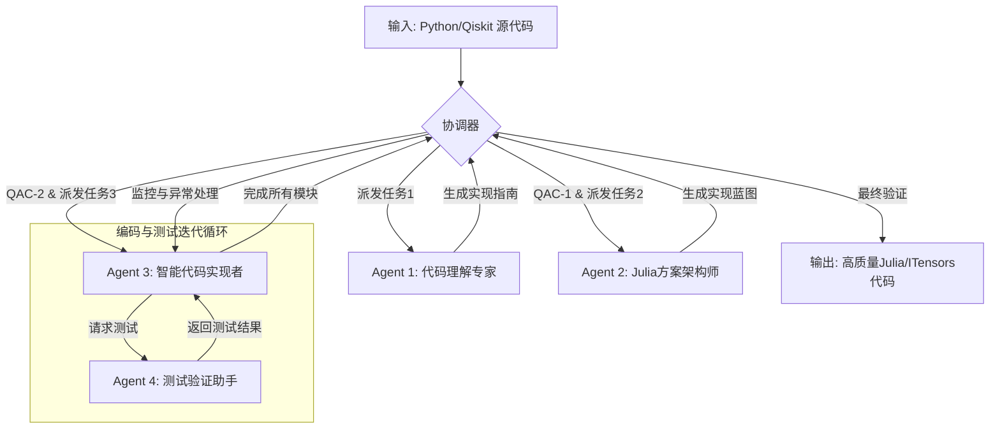

### Agent 4: 测试验证助手

### 一、 Agent定位与模拟目标

#### 1\. 模拟对象：程序员的“即时自测”本能

Agent 4 模拟的不是一个独立的测试团队，而是优秀程序员在编码时的一种内在习惯——**“即时自测”（Immediate Self-Testing）**。

当一个程序员写完一个函数，他会本能地思考：“这个函数能跑吗？输入特定值，输出是我期望的吗？”；当他实现一个核心算法，他会验证：“这个算法的逻辑对吗？边界情况考虑了吗？”。Agent 4 就是这个内置于开发流程中的、警觉而严谨的“测试员”，它与 Agent 3（代码实现者）形影不离，共同确保代码质量。

#### 2\. 工作方式：嵌入编码循环的持续验证

Agent 4 的核心价值在于其**实时性和持续性**。它并非在所有代码完成后才介入，而是深度嵌入到 Agent 3 的“读取-查询-编码-测试”（RQCT）循环中。

  - **Agent 3 每完成一个函数** -\> Agent 4 立刻进行单元测试。
  - **Agent 3 每实现一个算法模块** -\> Agent 4 立刻进行逻辑验证。
  - **Agent 3 每完成一次模块集成** -\> Agent 4 立刻进行接口测试。

这种“结对编程”式的模式确保了问题在第一时间被发现和修复，避免了错误的累积。

### 二、 工作核心：三层次渐进式测试协议

Agent 4 的测试策略是分层递进的，从最基础的语法检查到最核心的物理等价性验证，确保了测试的全面性和深度。

#### Level 1: 静态与语法层检查 ("代码能运行吗?")

这是最基础的防火墙，确保 Agent 3 生成的代码在语法和类型上是合规的。

  - **检查内容:**
      - **语法正确性：** 代码是否符合 Julia 语法规范，能否通过解析器。
      - **类型一致性：** 函数的参数类型和返回值类型是否与 Agent 2 蓝图中的签名 (`signature`) 声明一致。
      - **API调用：** 函数调用的参数数量和类型是否正确。
  - **反馈示例:**
      - `"SyntaxError: Invalid token at line 42."`
      - `"TypeError: Function 'build_tfim_hamiltonian' is declared to return 'MPO', but returned 'OpSum'. Did you forget the conversion?"`

#### Level 2: 逻辑与数值层检查 ("代码做得对吗?")

在代码可以运行的基础上，这一层验证其内部逻辑和数值属性是否符合预期。

  - **检查内容:**
      - **维度正确性：** 数据结构的维度是否与物理系统匹配？（例如：一个 `n=4` 量子比特的 MPS，其物理维度应为 $2^4=16$）。
      - **物理属性：** 关键对象是否具备应有的物理或数学属性？（例如：哈密顿量矩阵是否是厄米的 `ishermitian(H)`）。
      - **算法逻辑：** 对于已知输入，算法的输出是否符合预期？（例如：输入一个简单的边列表给 `partition_edges_to_layers`，输出的分层结果是否正确）。
  - **反馈示例:**
      - `"LogicError: The generated Hamiltonian is not Hermitian. Please check the construction of operator terms."`
      - `"DimensionMismatch: The output MPS for n=7 sites has an incorrect bond dimension. Expected 128, but got 64."`

#### Level 3: 物理等价层验证 ("它解决的是同一个问题吗?")

这是整个系统的最终目标和最高标准的测试。它确保新生成的 Julia 代码与原始 Python 代码在物理上是等价的。

  - **检查内容:**
      - **哈密顿量等价性：** 通过比较关键性质（如特征值谱）或直接比较矩阵元素（适用于小系统），验证 Julia 构建的 `MPO` 与 Python 的 `SparsePauliOp` 是否代表同一个物理算符。
      - **线路结构等价性：** 验证量子门的类型、顺序和作用位置是否与 Agent 1 分析出的结构一致。
      - **最终结果一致性：** 使用 Agent 1 提取的**完全相同的参数**运行完整的 Julia 代码，将其最终输出（如基态能量）与原始 Python 代码的输出进行比较，允许在合理的浮点误差（例如 `1e-6`）内的差异。
  - **反馈示例:**
      - `"PhysicalEquivalenceError: The gate sequence in 'apply_ansatz' does not match the source. Source was ['H_layer', 'ZZ_layer', 'RX_layer'], implementation is ['H_layer', 'RX_layer', 'ZZ_layer']."`
      - `"ResultMismatch: Final energy is -4.812. The expected value from the source code is -5.235. The deviation is outside the tolerance threshold."`

### 三、 反馈与修复机制

Agent 4 的反馈是具体、可操作的。

  - **定位问题：** 清晰指出错误类型、发生位置和相关变量。
  - **提供线索：** 给出可能的错误原因或修改建议（例如：“Julia 数组索引从 1 开始，请检查循环范围”）。
  - **循环验证：** Agent 3 根据反馈修改代码后，Agent 4 会重新运行相关测试，直到通过为止。

-----

### 协调器 (Coordinator): 智能流程指挥中心

在所有 Agent 之上，协调器扮演着项目经理和系统元认知的角色，确保整个流程顺畅、高效且能处理异常。

### 一、 角色定位与核心价值

协调器的存在是为了将四个独立的专家 Agent 黏合作一个有机的整体。它不执行具体任务，而是**指挥、监控和裁决**，保证系统目标的达成。

### 二、 核心职责

#### 1\. 流程与信息流管理

  - **任务派发：** 确保每个阶段的产物被准确无误地传递给下一个 Agent。
      - `Agent 1 完成 -> 验证输出完整性 -> 派发给 Agent 2`
      - `Agent 2 完成 -> 验证蓝图覆盖度 -> 派发 Agent 1 & 2 的产物给 Agent 3`
  - **启动迭代：** 启动 Agent 3 和 Agent 4 之间的“编码-测试”循环。

#### 2\. 质量保证检查点 (QAC)

在关键流程节点进行宏观检查，防止问题向下游传递。

  - **QAC-1 (后 Agent 1):** 理解是否全面？所有关键参数是否已提取？隐藏算法是否被标记？
  - **QAC-2 (后 Agent 2):** 实现蓝图是否覆盖了 Agent 1 的所有任务？技术选型是否合理？
  - **QAC-3 (Agent 3 & 4 循环中):** 实现是否偏离了蓝图？测试是否陷入了无法解决的死循环？

#### 3\. 智能异常处理

这是协调器“智能”的核心体现，它根据问题的性质决定最佳对策。

| 检测到的问题 | 诊断 | 决策指令 |
| :--- | :--- | :--- |
| **Agent 4 反复报告物理不等价** | 实现（Agent 3）或设计（Agent 2）可能有误，但根源可能是对原始代码的理解（Agent 1）有偏差。 | `指令: 暂停Agent 3/4。将物理不等价的详细日志发回给Agent 1，要求重新审查相关的算法逻辑。` |
| **Agent 3/4 迭代超过上限（如10次）** | 当前的设计或实现路径可能存在根本性问题，无法通过小修小补解决。 | `指令: 终止当前迭代。将问题日志发回给Agent 2，要求重新评估实现策略或函数设计。` |
| **Agent 2 发现无法找到合适的Julia库** | RAG知识库可能不完备，或这是一个需要从更底层手动实现的功能。 | `指令: 标记该功能为“需要手动实现底层逻辑”，并调整实现蓝图，分配更详细的伪代码策略。` |

### 三、 最终系统工作流

整合所有组件后，整个量子代码智能转换系统的工作流程如下：

